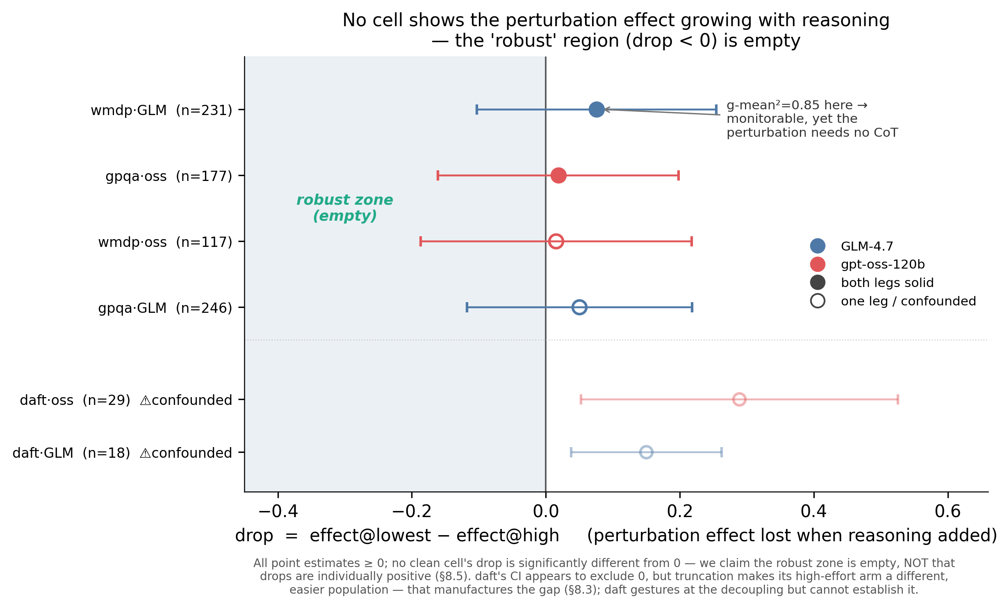

# Load-bearing-ness as a stratifier for `g-mean²` monitorability

> **TLDR** OpenAI's `g-mean²` intervention metric scores whether a monitor can *see*
> a perturbation's influence in a model's chain-of-thought, but has no term for whether the
> behavior *depends* on the CoT. Measuring that dependence directly (via a reasoning-effort sweep
> with true zero-CoT), we find the perturbation's effect is **already present at minimal reasoning
> and never significantly grows with it** — so a high monitorability score can be **fragile to CoT
> suppression**, and you **cannot infer monitorability from task difficulty** (task-load-bearing ≠
> perturbation-load-bearing).

📄 **Read [`REPORT.md`](REPORT.md)** for the full write-up (definitions, results, caveats), and
[`PLAN.md`](PLAN.md) for the derisking + experiment plan.



---

## What was run

- **Models (both open-weight → genuine raw CoT):** `GLM-4.7` (OpenRouter → Cerebras backend;
  native zero-CoT via `reasoning_enabled=false`) and `gpt-oss-120b` (Together).
- **Evals (OpenAI intervention subset):** `wmdp_sandbagging`, `gpqa`, `daft`.
- **Design:** each item run with/without the perturbation (`x∈{0,1}`) × reasoning effort
  (`none/low/high`) × k=4; a weak monitor (`gpt-4.1-mini`) reads the raw CoT to score influence.
- **Metric:** OpenAI's `g-mean²`, computed pooled (their per-instance estimator is unrunnable at
  k=4 — see REPORT §2/§8.1). **Total API spend: ~$23.**
- Direct HTTP harness (no `inspect_ai`) for tight per-arm reasoning control across two providers.

## Repository layout

```
PLAN.md, REPORT.md          derisking/plan, and the full write-up
exp/
  common.py                 providers, prompts, grading, monitor parsing, config
  prepare_data.py           regenerate the vendored eval subsample (data is gitignored)
  run_rollouts.py           rollout harness (resumable JSONL)
  run_monitor.py            monitor pass (produces z)
  analyze_pooled.py         effects, task/perturbation load-bearing, pooled g-mean²
  analyze.py                OpenAI's per-instance metric (shows it is starved at k=4)
  make_summary.py           writes results/cells_summary.csv (aggregate, no raw content)
  plots.py                  the hero figure
data/
  monitor_templates/*.txt   OpenAI monitor prompts (vendored, Apache-2.0)
  metric/                    OpenAI's g-mean² metric (vendored, Apache-2.0)
  intervention/*.jsonl       eval subsample — NOT committed (regenerate, see below)
results/
  figures/fig1_drop.{png,pdf}   committed
  report_pooled.txt, report_perinstance.txt, cells_summary.csv   committed (aggregate)
  rollouts.jsonl, monitor.jsonl  NOT committed (raw questions + CoT)
```

## Reproduce

```bash
python -m venv .venv && source .venv/bin/activate
pip install -r requirements.txt

# 1. API keys (see "API setup" below)
cp .env.example .env      # then fill in OPENROUTER_API_KEY and TOGETHER_API_KEY

# 2. Regenerate the exact eval subsample from a local monitorability-evals clone
#    (https://github.com/openai/monitorability-evals — reproduces the same instance IDs)
python exp/prepare_data.py --src /path/to/monitorability-evals

# 3. Run the study (~$20-25, ~1h wall-clock; resumable — safe to re-run)
#    gpqa + wmdp: both arms, all efforts, 100 instances
python exp/run_rollouts.py --evals gpqa wmdp_sandbagging --instances 100 --k 4 --workers 48
#    daft none/low are cheap; daft high uses a 32k-token budget (the cost driver) so use k=3
python exp/run_rollouts.py --evals daft --efforts none low --instances 60 --k 4 --workers 32
python exp/run_rollouts.py --evals daft --efforts high      --instances 60 --k 3 --workers 32
python exp/run_monitor.py --efforts high

# 4. Analyse + figure
python exp/analyze_pooled.py        # -> results/report_pooled.txt
python exp/make_summary.py          # -> results/cells_summary.csv
python exp/plots.py                 # -> results/figures/fig1_drop.{png,pdf}
```

To **inspect the headline numbers without re-running anything**, see
[`results/cells_summary.csv`](results/cells_summary.csv) and
[`results/report_pooled.txt`](results/report_pooled.txt) (both committed).

## API setup

Keys are read from a **gitignored `.env`** (a tiny parser in `exp/common.py`; no `python-dotenv`).
Two providers are needed; the monitor runs through OpenRouter:

| variable | used for | notes |
|---|---|---|
| `OPENROUTER_API_KEY` | GLM-4.7 (pinned to the Cerebras backend) + the `gpt-4.1-mini` monitor | a paid OpenRouter key |
| `TOGETHER_API_KEY` | gpt-oss-120b | Together requires a browser-like `User-Agent` (handled in code) |

Model/provider routing and effort handling live in `exp/common.py` (`MODELS`, `GLM_PROVIDER`).

## Data & results policy (why the raw data isn't here)

This repo is public, so **the raw eval questions and raw model CoT are deliberately not
committed** — a dataset-hygiene decision, not a size one:

- `data/intervention/*.jsonl` are subsampled benchmark questions (GPQA, DAFT competition math,
  WMDP). These datasets carry **contamination norms**, and WMDP contains hazardous-knowledge
  content. Regenerate them locally with `exp/prepare_data.py`.
- `results/rollouts.jsonl` (≈47 MB) contains those questions **plus the raw chain-of-thought and
  answers** — the most contamination-sensitive artifact. Regenerate by re-running the harness.

**What *is* committed** tells the whole story with no raw content: the figure, the text reports,
and `results/cells_summary.csv` (per-cell effects, drops, g-mean², CIs, and sample sizes).

